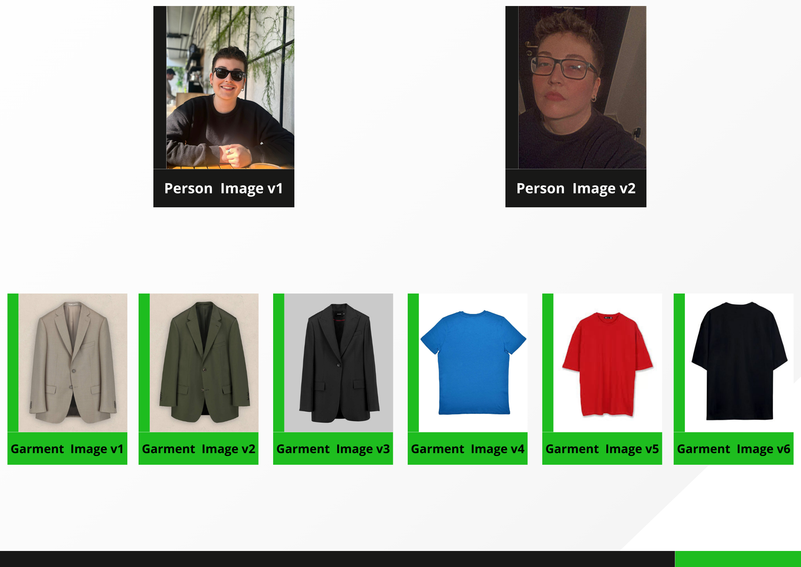
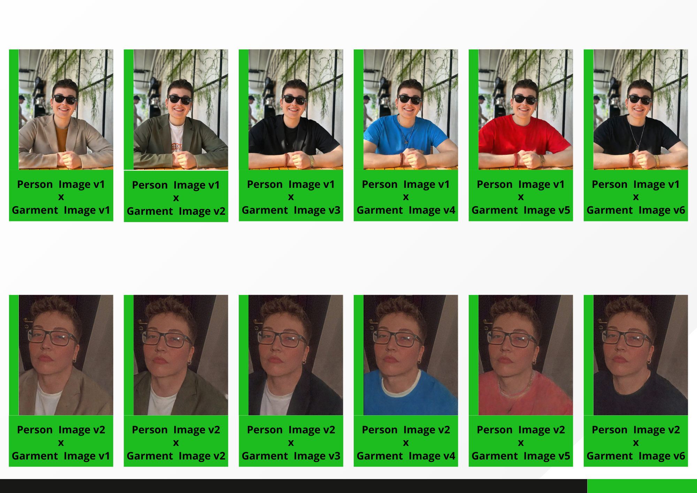

# Virtual-Try-On

This is a Flask-based API application that enables users to perform a virtual try-on of garments on a person's image. The application processes uploaded images (person and garment) and utilizes a backend API to generate a try-on result.

## Table of Contents

- Features
- Requirements
- Installation
- Usage
- API Endpoints
- Error Handling
- Logging

## Features

- Health check endpoint to ensure the API is up and running.
- Virtual try-on endpoint that accepts person and garment images, processes them, and returns the result.
- Supports seeding for randomization in the virtual try-on process.
- Detailed logging for easier debugging and monitoring.

## Requirements

- Flask==2.2.5
- Werkzeug==2.2.3
- gradio_client
- flasgger==0.9.7.1
- python-dotenv==0.21.0

## Installation

1. Clone the Repository:
   ```bash
   git clone <https://github.com/dagaca/virtual-try-on.git>
   cd <virtual-try-on>
   ```
   
2. Create and Activate a Virtual Environment:
   ```bash
   python -m venv venv
   source venv/bin/activate  # On Windows use `venv\Scripts\activate`
   ```
   
3. Install the Dependencies:
   ```bash
   pip install -r requirements.txt
   ```
   
4. Set Up Configuration:
   - Create a .env file in the root directory and configure your environment variables as needed.
   - Example:
       - RESULT_FOLDER=results
       - TEMP_FOLDER=temp
       - LOG_DIR=logs
       - LOG_FILE=app.log

5. Run the Application:
   ```bash
   flask run

   The application will start running on http://127.0.0.1:5000/.
   ```
   
## Usage

- Use a tool like Postman or curl to interact with the API endpoints.
- Make sure to send multipart/form-data for endpoints that accept file uploads.

## API Endpoints

1. Health Check

- Endpoint: /health
- Method: GET
- Description: Checks if the API is up and running.
- Response: "OK" with HTTP status code 200.

2. Virtual Try-On

- Endpoint: /tryon
- Method: POST
- Description: Accepts a person image and a garment image, processes them, and returns the try-on result image.
- Parameters:
  - person_img: The person's image for virtual try-on (required).
  - garment_img: The garment image for virtual try-on (required).
  - seed: Optional seed for randomization (default is 0).
  - randomize_seed: Optional boolean to randomize the seed (default is true).
- Response: Returns the try-on result image as a file.

## Error Handling

- The API returns appropriate HTTP status codes for different types of errors:
  - 400: Bad Request (e.g., missing required files).
  - 500: Internal Server Error (e.g., file not found, unexpected errors).

## Virtual Try-On Experiments

This project involves conducting various professional virtual try-on experiments using my own photos and different garment images. For this project, I used two personal photos and experimented with six different garment images. 

### Input Photos and Garments

The first image below shows the two personal photos and six different garment images used in the experiments. Each photo was tested with each garment to explore the versatility of the virtual try-on system.



### Experiment Results

The following image illustrates the results of these virtual try-on experiments. It displays how each of the personal photos looks when combined with the different garments, demonstrating the functionality and effectiveness of the virtual try-on system.



All detailed results of these experiments are stored and can be accessed in the `results` folder. The results folder contains all the individual outcomes of the combinations tested during the experiments.

## Acknowledgments

This application uses the Kolors Virtual Try-On API provided by the Kwai team, available on Hugging Face Spaces. You can find more information and access the API here: [Kolors Virtual Try-On](https://huggingface.co/spaces/Kwai-Kolors/Kolors-Virtual-Try-On).

## Logging

- The application logs important events, such as requests received, file paths, and errors, using Python's built-in logging module.
- Log files can be found in the specified logging directory or console, depending on your configuration.
